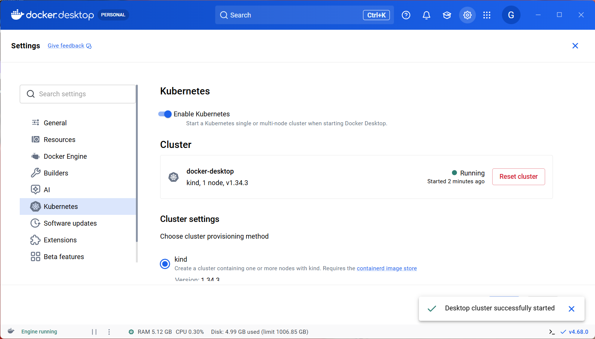
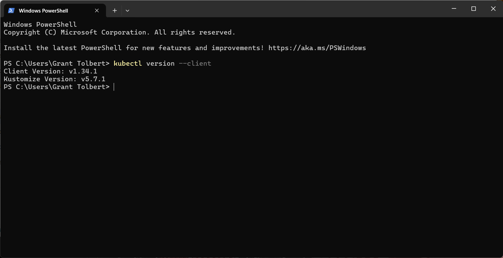
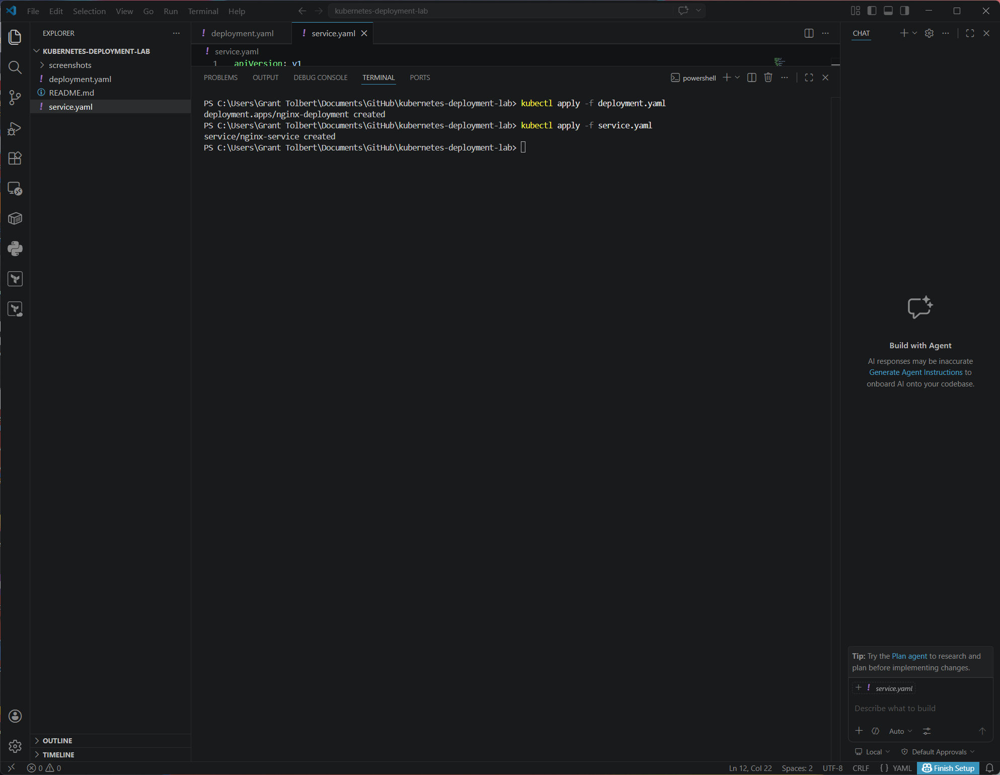
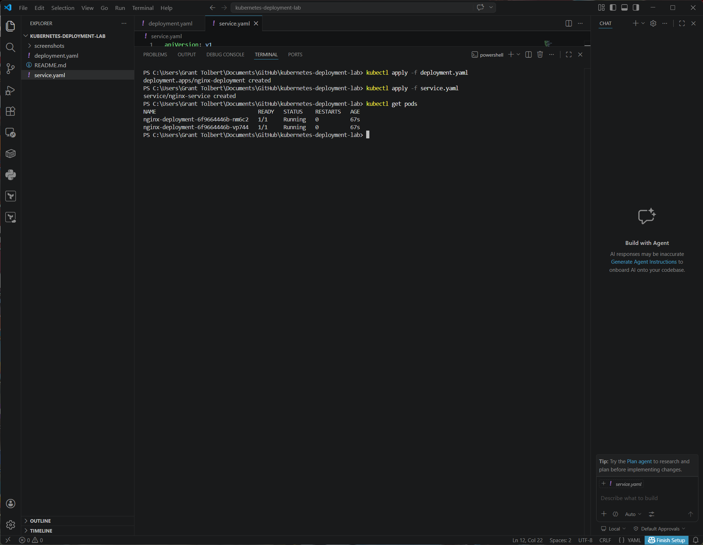
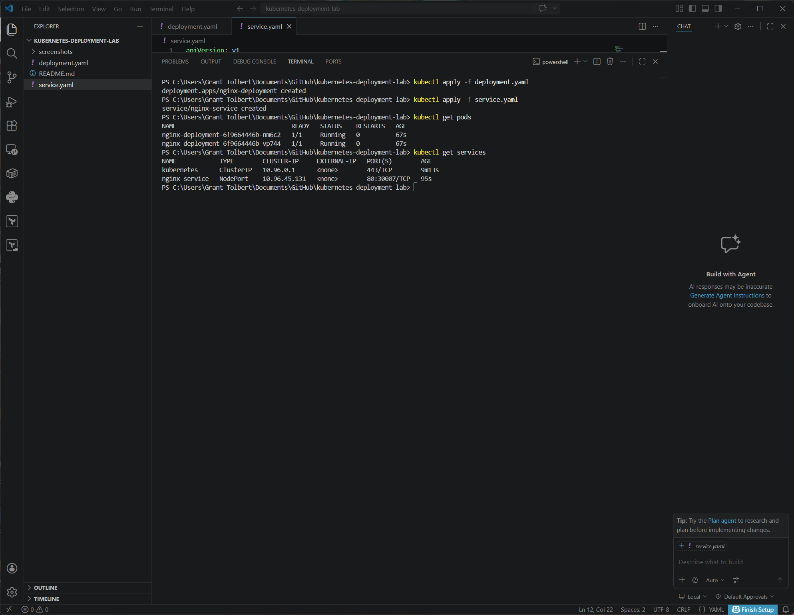
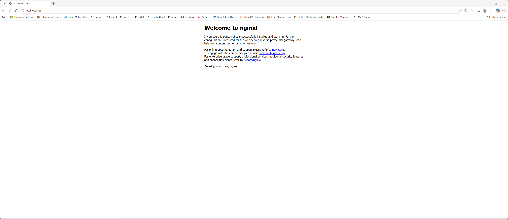
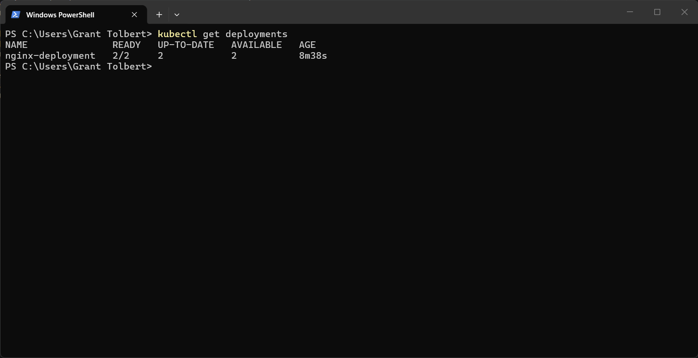
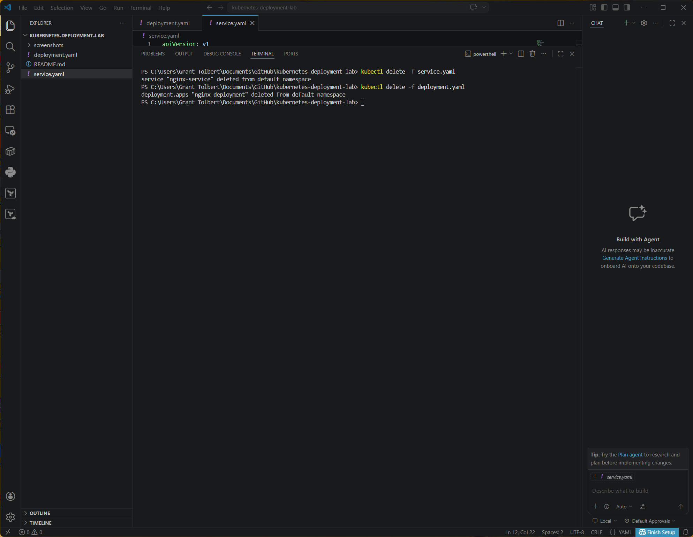

# Kubernetes Deployment Lab

Containerized web application deployment using Kubernetes deployments and services.

---

# Overview

This project demonstrates deploying a containerized application to a Kubernetes cluster using Kubernetes manifests and kubectl.

The lab deploys an NGINX web server using a Kubernetes Deployment and exposes the application using a Kubernetes Service.

---

# Architecture

Kubernetes Cluster

Deployment
• NGINX Pods (replicas)

Service
• NodePort Service exposing the application

Traffic Flow

User Browser
↓
Kubernetes Service
↓
NGINX Pods

---

# Technologies Used

Kubernetes
kubectl
Docker Desktop Kubernetes
NGINX
Windows 11 / WSL
Visual Studio Code

---

# Project Structure

kubernetes-deployment-lab

deployment.yaml
service.yaml
README.md

screenshots
01-kubernetes-enabled.png
02-kubectl-version.png
03-kubectl-deploy.png
04-kubernetes-pods.png
05-kubernetes-service.png
06-nginx-kubernetes.png
07-kubernetes-deployments.png
08-kubernetes-delete.png
09-kubernetes-get-all.png

---

# Kubernetes Deployment Configuration

deployment.yaml

Defines a Kubernetes deployment with two NGINX pods.

Key configuration

replicas: 2
container image: nginx:latest
containerPort: 80

---

# Kubernetes Service Configuration

service.yaml

Defines a NodePort service that exposes the NGINX pods.

Service type

NodePort

External port

30007

---

# Commands Used

Deploy application

kubectl apply -f deployment.yaml
kubectl apply -f service.yaml

View pods

kubectl get pods

View services

kubectl get services

View deployments

kubectl get deployments

View all Kubernetes resources

kubectl get all

Port forward for local access

kubectl port-forward service/nginx-service 8085:80

Access application

http://localhost:8085

Delete resources

kubectl delete -f service.yaml
kubectl delete -f deployment.yaml

---

# Screenshots

Kubernetes enabled in Docker Desktop

kubectl version

Deployment created

Pods running

Service running

NGINX application deployed on Kubernetes

Deployments list

Resources deleted

Kubernetes resources overview

---

# Key Concepts Demonstrated

Kubernetes deployments
pod orchestration
containerized application deployment
service exposure
cluster resource management
infrastructure automation

---

# Author

Grant Tolbert
Cloud Infrastructure Portfolio Project
